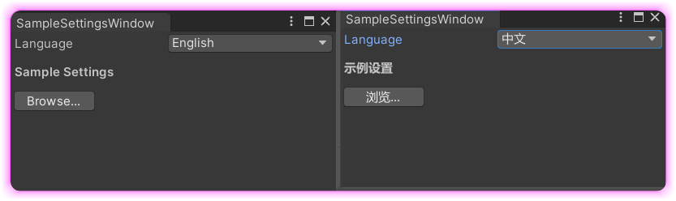

# UnityPluginLocalization

Unity本地化插件，支持多语言切换，使用JSON文件管理翻译内容，提供简洁的API接口。

## 功能特点
- 支持多语言动态切换
- JSON格式语言文件管理
- 编辑器内语言切换工具
- 简洁的本地化字符串调用接口

## 安装步骤
1. 将Localization文件夹复制到指定的Unity插件的Editor目录下，比如`xxx/Editor/Settings`
2. 在 `Localization/L10n` 目录下配置需要支持的多语言的json文件
3. 修改 `LocalizationDefine.cs`，指定多语言设置保存的EditorPrefs key和默认语言

## 使用方法

### 1. 配置语言文件
在Localization/L10n目录下创建或修改语言文件，格式如下：
```json
{
    "entries": [
        {"key": "sampleSettingsLabel", "value": "示例设置"},
        {"key": "browseButton", "value": "浏览..."},
        {"key": "click", "value": "点击!"}
    ]
}
```

### 2. 代码中使用本地化字符串
```csharp
// 获取本地化字符串
string localizedText = L10nHelper.Tr("sampleSettingsLabel");

// 在UI中显示
EditorGUILayout.LabelField(localizedText, EditorStyles.boldLabel);

// 按钮示例
if (GUILayout.Button(L10nHelper.Tr("browseButton"), GUILayout.Width(80)))
{
    Debug.Log(L10nHelper.Tr("click"));
}
```

### 3. 切换语言演示
通过编辑器窗口切换语言：
1. 打开菜单 "Tools/SampleWindow"
2. 在弹出的窗口中选择所需语言
3. 插件会自动重新加载对应语言文件

## 扩展语言支持
添加新的语言支持：
1. 在LocalizationDefine.cs中添加语言选项和代码：
```csharp
public static readonly string[] LanguageOptions = new[] { "English", "中文", "新语言" };
public static readonly string[] LanguageCodes = new[] { "en", "zh", "newlang" };
```
2. 在L10n目录下创建对应的newlang.json文件
3. 重新编译项目

## Demo
示例窗口代码位于SampleSettingsWindow.cs，展示了如何集成本地化功能到编辑器窗口。

